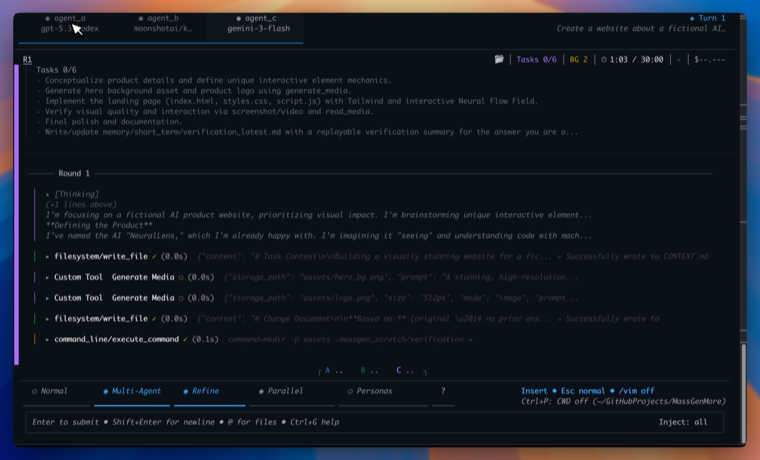

## About Me

I am an **AI PhD** at [BAIR](https://bair.berkeley.edu/), UC Berkeley. I design benchmarks that measure whether AI agents can do long-horizon, economically valuable work, and study how agents can close the gaps those benchmarks expose.

## Research Interests

- **AI agents:** agents that complete long-horizon, real-world tasks reliably
- **AI evaluation:** living benchmarks with verifiable, economically grounded outcomes
- **Multimodal:** perception and reasoning across vision and language
- **AI for health:** agents and evaluation in high-stakes clinical settings

## News

- **[Jun 2026]** [Agents’ Last Exam](https://agents-last-exam.org) is out: a living benchmark of long-horizon, economically valuable tasks drawn from real professional work.
- **[Jun 2026]** Agents’ Last Exam hits **#1 on [Hugging Face Daily Papers](https://huggingface.co/papers?date=2026-06-09)** and **#1 trending on [alphaXiv](https://www.alphaxiv.org/abs/2606.05405)**.
- **[Jun 2026]** Agents’ Last Exam is covered by [VentureBeat](https://venturebeat.com/technology/surprise-upset-gpt-5-5-beats-claude-fable-5-on-brutal-new-agents-last-exam-benchmark) and [Digg](https://digg.com/ai/7f6dnk0l).
- **[May 2026]** [JobBench](https://job-bench.github.io/) is released, asking which work people actually want to delegate to agents.
- **[May 2026]** [MLS-Bench](https://mls-bench.com/) is released, testing whether AI systems can build better AI.
- **[2026]** Glad to serve as the Communications Chair for [CHIL 2026](https://chil.ahli.cc/organizers/).
- **[2026]** Organizing the [Workshop on Agent Behavior](https://www.aiagentbehavior.com/) at COLM 2026.
- **[2025]** Served as the Logistics Chair for CHIL 2025.
- **[Apr 2024]** [SAP3D](https://sap3d.github.io/) is accepted to CVPR 2024 as a **Highlight**.



* Equal contribution or core contributor &nbsp;&middot;&nbsp; &dagger; Equal advising

## Open Source

<ol class="bibliography">
<li>

  

    
  

  

    
<a href="https://github.com/massgen/MassGen" target="_blank" rel="noopener noreferrer">MassGen: Multi-Agent Scaling System</a>

    
Contributor

    
<em>Open-source system that orchestrates frontier models and agents to collaborate, reason, and produce high-quality results.</em>

    

      <a href="https://github.com/massgen/MassGen" class="btn btn-sm z-depth-0" role="button" target="_blank" rel="noopener noreferrer" style="font-size:12px;">GitHub</a>
      <a href="https://massgen.ai" class="btn btn-sm z-depth-0" role="button" target="_blank" rel="noopener noreferrer" style="font-size:12px;">Docs</a>
    

  

</li>
</ol>

